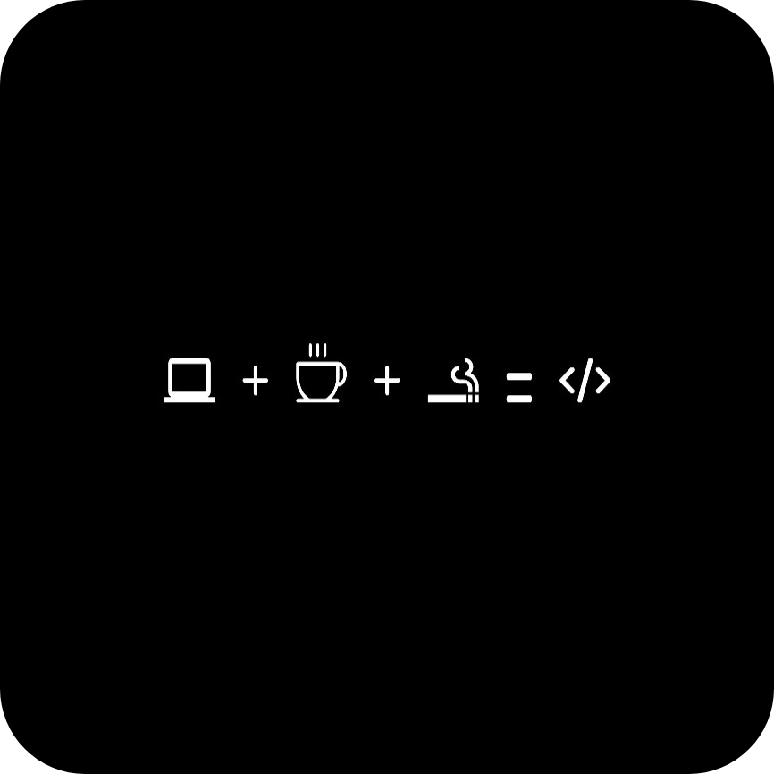

  
  <h2>🧑‍💻 Vrim — Fullstack Developer & System Explorer</h2>

---

## 🚀 Tech Stack

### 🖥️ Frontend
<table align="center">
  <tr>
    <td> Astro</td>
    <td> HTML5</td>
    <td> JavaScript</td>
    <td> TypeScript</td>
    <td> TailwindCSS</td>
    <td> Bootstrap</td>
  </tr>
</table>

### 🧠 Backend / Fullstack
<table align="center">
  <tr>
    <td> React</td>
    <td> Next.js</td>
    <td> NestJS</td>
    <td> Node.js</td>
    <td> Golang</td>
    <td> Python</td>
    <td> Spring Boot</td>
    <td> Java</td>
  </tr>
</table>

---

## 🛠️ Dev & Collaboration
<table align="center">
  <tr>
    <td> Git</td>
    <td> GitHub</td>
    <td> VS Code</td>
    <td> Docker</td>
    <td> Linux</td>
  </tr>
</table>

---

## 📊 GitHub Stats

  
   
  
   
  

---

## 🌐 Stay in Touch

  
  

